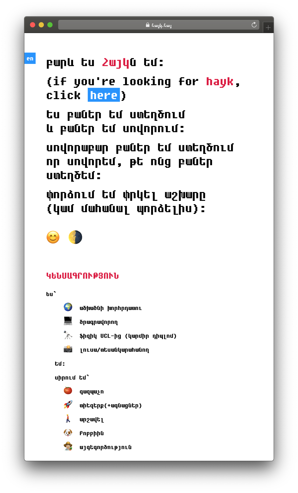

# խաչատրյան.հայ/կ

> անձնական կայք

For the english version, go [here](https://github.com/haykkh/haykkh.github.io).

 



## 📦 Ծրագրի ներդրում

### 📋 Կլոնավորել պահոցը

```sh
git clone https://github.com/haykkh/khachatryan.hay.git

cd hayk-am

yarn
```

### ⬇️ Ուղիղ բեռնել

[khachatryan.hay-master.zip](https://github.com/haykkh/khachatryan.hay/archive/master.zip)

```sh
cd khachatryan.hay

yarn
```

## 🚀 Օգտագործում

Օգտագործում է [Parcel](https://parceljs.org/) ֆայլերի փաթեթավորման համար:

```sh
yarn start  # սկսել ծրագրավորման սերվեր

yarn build  # կառուցել կայքը ./docs/-ում
```

## 📝 Աջակցել

1. Ճյուղավորեք պահոցը (<https://github.com/haykkh/khachatryan.hay/fork>)
2. Ստեղծեք ձեր առանձնահատկությունների մասնաճյուղ (`git checkout -b feature/fooBar`)
3. Commit արեք ձեր փոփոխությունները (`git commit -am 'Add some fooBar'`)
4. Push արեք ճյուղին (`git push origin feature/fooBar`)
5. Ստեղծեք նոր Pull Request

## 👨🏻 Մետա

Հայկ Խաչատրյան – [hi@hayk.io](mailto:hi@hayk.io)

[github.com/haykkh](https://github.com/haykkh/)
